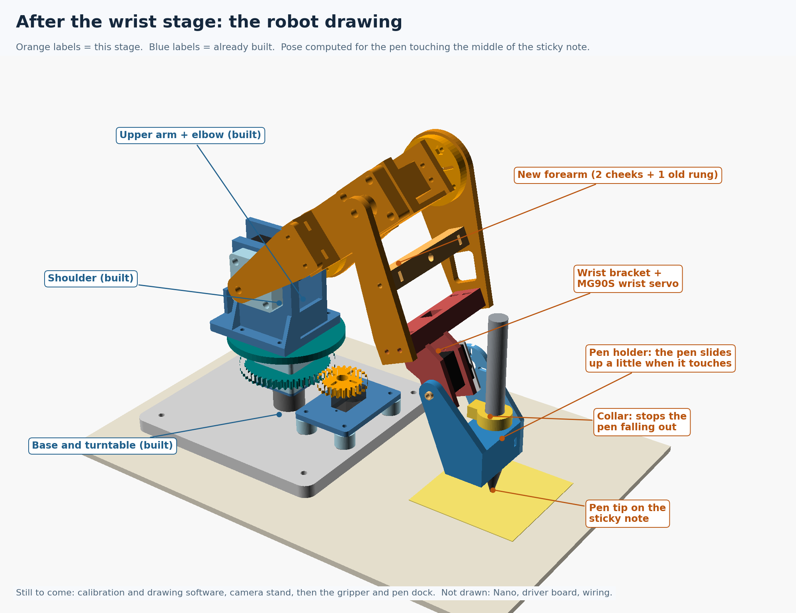

# Scribbot

A low-cost, mostly 3D-printed desktop robot arm that draws on a 3 × 3 inch sticky note.

- **4 hobby servos:** MG90S base (through a 2:1 printed gear), MG996R shoulder, MG996R elbow, MG90S wrist
- **Electronics:** Arduino Nano + PCA9685 servo driver, 5 V supply
- **Pen:** a standard Sharpie in a gravity holder. It slides up a few millimeters when it touches the paper, so it presses with just its own weight.
- **Everything printable** is in OpenSCAD source plus ready-to-print STLs (PLA, 0.4 mm nozzle, 0.12 mm layers, no supports)
- **Planned:** a webcam stand and vision, so it can find the paper and draw what it sees

## Build stages

Each folder in [`design/`](design) has a `START_HERE.md` with print settings, hardware and step-by-step assembly, plus diagrams.

| # | Stage | Folder | Status |
|---:|---|---|---|
| 1 | Fit coupons: servo bodies, bearing pocket, slider clearance | [`phase-2`](design/phase-2) | Done |
| 2 | Servo mounting-hole templates | [`mounting-templates`](design/mounting-templates) | Done |
| 3 | Servo mount plates + bearing carrier | [`mechanical-fit-v1`](design/mechanical-fit-v1) | Done |
| 4 | Bearing turntable | [`compact-base-stage-1`](design/compact-base-stage-1) | Done |
| 5 | Base servo mount and gear mesh | [`compact-base-stage-2`](design/compact-base-stage-2), [`base-horn-fit`](design/base-horn-fit) | Done |
| 6 | First power-on: wiring + centering | [`base-servo-test`](design/base-servo-test) | Done |
| 7 | Base calibration + repeatability | [`base-calibration`](design/base-calibration) | Done |
| 8 | Shoulder + load test | [`shoulder-horn-fit`](design/shoulder-horn-fit), [`shoulder-stage`](design/shoulder-stage) | Done |
| 9 | Elbow | [`elbow-stage`](design/elbow-stage) | Done |
| 10 | Wrist + pen holder | [`pen-fit`](design/pen-fit), [`wrist-stage`](design/wrist-stage) | Done |
| 11 | Calibration and drawing software | [`calibration`](design/calibration), [`drawing`](design/drawing) | Done: draws squares, circles, stars and text |
| 12 | Camera stand + vision | | Planned |

[`rotating-base-v1`](design/rotating-base-v1) and [`compact-base-review`](design/compact-base-review) are earlier base designs kept for reference. Don't build them.

The running build log is [`design/CURRENT_BUILD_STATUS.md`](design/CURRENT_BUILD_STATUS.md).

## Geometry

| | |
|---|---|
| Upper arm, forearm | 120 mm each, joint to joint |
| Shoulder axis | 127 mm above the table (measured) |
| Pen | tip 67 mm below the wrist axis (measured), offset 25 mm forward |
| Drawing area | 60 × 60 mm patch on the sticky note, 135-197 mm out from the base |

## Wiring

| Nano | PCA9685 |
|---|---|
| 5V | VCC |
| GND | GND |
| A4 | SDA |
| A5 | SCL |

Servo power goes only into the PCA9685's green screw terminal, never through the Nano. Channels: 0 base, 1 shoulder, 2 elbow, 3 wrist.

## Test program

[`design/wrist-stage/arm_test/arm_test.ino`](design/wrist-stage/arm_test/arm_test.ino) drives all four joints over USB serial (115200 baud, no libraries needed). Commands start with the joint letter: `b` base, `s` shoulder, `e` elbow, `w` wrist. For example `s1300`, `e+`, `wo` (wrist off), or `o` for everything off. Outputs stay off at startup, and every move is slow and stepped.

## Calibration

The servo horns never land exactly on the design angles, so each joint gets an offset and a gain. They come from tape-measure heights of the shoulder, elbow, wrist and pen tip in three poses. In the last pose the wrist works as a level: the pen is set straight down and only the wrist pulse is read. The method and the numbers are in [`design/calibration/measurements.md`](design/calibration/measurements.md).

## Drawing

[`design/drawing/draw/draw.ino`](design/drawing/draw/draw.ino) does the inverse kinematics on the Nano and keeps the pen vertical. Lines are cut into 1 mm steps.

1. Put a sticky note with its center 166 mm (6 1/2 in) straight out from the turntable.
2. `h` hovers over the note. Lower the pen with `d` (1 mm) or `D` (5 mm) until it just touches the paper, then send `t` to save that height.
3. Draw:
   - `q` square
   - `c` circle
   - `s` star
   - `wHELLO` text: letters and numbers, up to 8 characters

`l` / `r` rotate the drawing 1°. `m` / `v` mirror or flip the text. `o` turns every joint off.

## License

[MIT](LICENSE): designs, STLs and code are free to use, modify and share, with the copyright notice kept.
